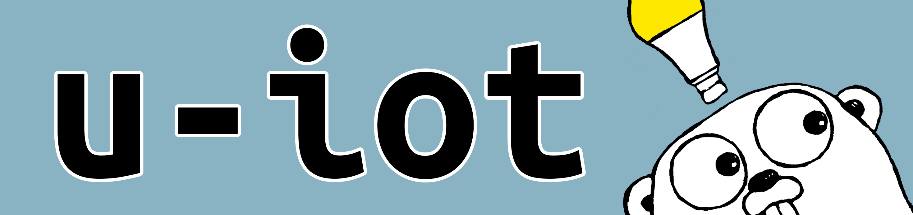

# u-iot

A framework and protocol for building your own smart home devices and applications. Intended to provide complete freedom in device functionality, u-iot will support applications on host operating systems, as well as embedded devices with abilities and parameters on Raspberry Pi.

u-iot will be written in Go.

## More to come in the future!

 See the [Design Doc](DESIGN.md) for what this project will become.

###### The Go gopher was designed by [Renee French](http://reneefrench.blogspot.com/). The design is licensed under the Creative Commons 3.0 Attributions license. Read [this article](https://blog.golang.org/gopher) for more details.
