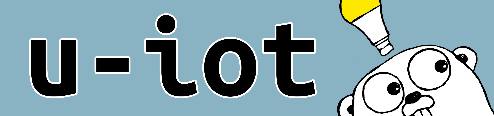

# u-iot



###### The Go gopher was designed by [Renee French](http://reneefrench.blogspot.com/). The design is licensed under the Creative Commons 3.0 Attributions license. Read [this article](https://blog.golang.org/gopher) for more details.

A framework and protocol for building your own smart home devices and applications. Intended to provide complete freedom in device functionality, u-iot supportS applications on host operating systems, as well as embedded devices with user-defined functions and parameters on Raspberry Pi.

u-iot is written in Go, with more languages coming in the future.

## Installation

### Golang
If you are using modules:
```golang
import uiot github.com/TrevorFarrelly/u-iot
```
then build when you are ready.

Or, if you are using dep:
```golang
import uiot github.com/TrevorFarrelly/u-iot
```
```
$ dep ensure
```

### Python
TBD

## Reference
GoDoc-style documentation can be found at [TrevorFarrelly.github.io/u-iot/](https://TrevorFarrelly.github.io/u-iot/).

## Using Raspberry Pi GPIO

A Golang wrapper of WiringPi can be found [here](https://github.com/hugozhu/rpi).

I have also forked this repo and hacked in PWM support, see [here](https://github.com/TrevorFarrelly/rpi).

More info on Pi installation can be found in [`examples`](examples/README.md)

## Progress

u-iot's Golang library is usable and firmly within the realm of a "minimum viable product." That said, there is lots of functionality I plan on implementing in the future. See the checklist below for progress on these features.

| Golang   | Feature           | Breaking? | Completion | | Python | Feature           | Breaking? | Completion |
|----------|-------------------|-----------|------------|-|--------|-------------------|-----------|------------|
|          | Device Creation   | No        | &#9745;    | |        | Device Creation   | No        | &#9744;    |
|          | Basic Device Tags | No        | &#9745;    | |        | Basic Device Tags | No        | &#9744;    |
|          | Multicasting      | No        | &#9745;    | |        | Multicasting      | No        | &#9744;    |
|          | RPC server        | No        | &#9745;    | |        | RPC Server        | No        | &#9744;    |
|          | Bootstrapping     | No        | &#9745;    | |        | Bootstrapping     | No        | &#9744;    |
| __v0.1__ | Function Calls    | No        | &#9745;    | |        | Function Calls    | No        | &#9744;    |
|          | Return Values     | No        | &#9744;    | |        | Return Values     | No        | &#9744;    |
|          | More arg types    | Yes       | &#9744;    | |        | More arg types    | Yes       | &#9744;    |
|          | User Device Tags  | Maybe     | &#9744;    | |        | User Device Tags  | Maybe     | &#9744;    |
|          | Security          | Maybe     | &#9744;    | |        | Security          | Maybe     | &#9744;    |

Anyone is welcome to work on these features. Please check out [CONTRIBUTING.md](CONTRIBUTING.md) if you are interested.


Status reporting:
on device creation, add variables to status:
`device.AddStatusVar(name, &var)`
internally, get type of status var using `printf("%t")`
send over RPCs when requesting
convert data into byte array, and decode on the other end based on rules set by 

In the future, attach it to function returns too. Updates device struct automatically, i.e. push vs. pull
