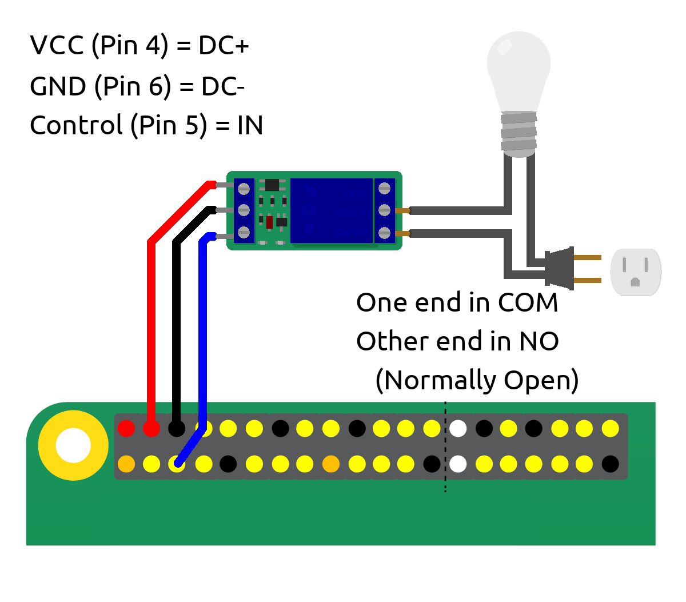
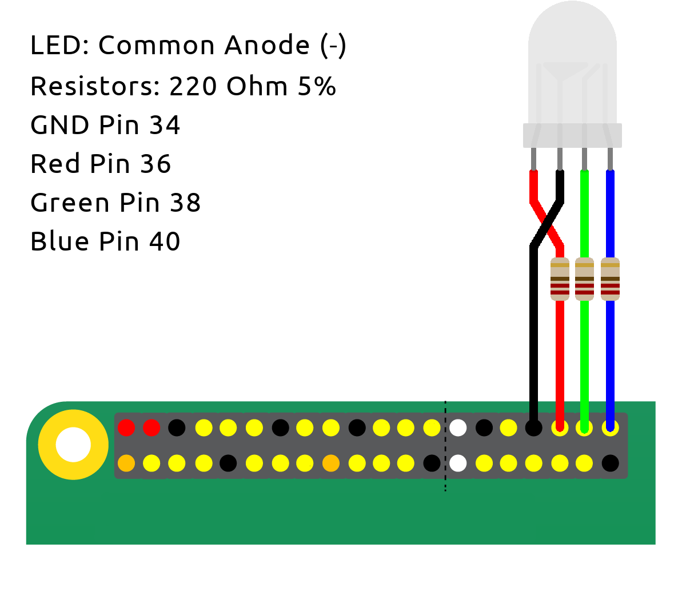

# u-iot Example Programs

This directory contains example programs making use of u-iot. Descriptions of each, including wiring diagrams for those that need them, can be found below.

## Pi Installation Process

1. Install Raspbian Lite on your SD card via [Imager](https://www.raspberrypi.org/downloads/) or your favorite imaging program.

2. Mount the boot directory to your host OS:
    * `$ sudo mount /dev/XXX1 /path/to/mnt/`
    * NOTE: find `XXX` using `$ lsblk`. It should be something like `sdb1` or `mmcblk0p1`.

3. Add an empty file named `ssh` to allow remote SSH into the device:
    * `$ echo "" > /path/to/mnt/ssh`

4. Add network information so the Pi can connect to wifi. Copy [`wpa_supplicant.conf`](wpa_supplicant.conf) into the mounted directory, replacing `YOUR_SSID` and `YOUR_WIFI_PASSWORD` with your network information:
    * `$ cp wpa_supplicant.conf /path/to/mnt/`
    * NOTE: this step is unnecessary if you are using Ethernet to connect to your Pi

5. Boot up the Pi and find its IP. This can be done in one of two ways:
    * Connect it to a keyboard and monitor and type `ip addr`.
      * _If you do it this way, I recommend skipping step 6 and proceeding locally._
    * Log into your router settings and find the IP it was assigned to.

6. SSH into the Pi:
    * `$ ssh pi@XXX.XXX.XXX.XXX`
    * NOTE: the default password will be `raspberry`. I __highly__ recommend changing this now.

7. Install Go and get the u-iot repositories:
    * `$ sudo apt install golang`
    * `$ go get github.com/TrevorFarrelly/u-iot`
    * `$ go get github.com/TrevorFarrelly/rpi`

8. Done! Run an example program, or write your own. If you are setting up a more permanent device, I recommend adding a `systemd` entry to run it automatically on startup. Instructions on how to do so can be found [here](https://www.raspberrypi.org/documentation/linux/usage/systemd.md).

## Example Programs

### `helloworld.go`

  `helloworld` contains basic demonstrations of the main features of u-iot: function definition, parameter ranges, and device detection using the eventing channel. It can be run locally as it does not need GPIO, and serves as a good test device when building a new interface program.

### `interface.go`

  `interface` contains a basic CLI program for interacting with other u-iot devices. It supports calling one function on one device using the `CallOne` keyword, or calling a function on multiple devices using `CallAll` and pattern-matching device tags. _NOTE: the device list that is printed on startup does not update. If new devices join after startup, they can be called, they just won't appear in the list._

### `relay.go`
  `relay` contains code for controlling a relay (and, thus, any 120v AC appliance) using a Pi's GPIO. If you use this code yourself, ensure that the relay you use has a 5v control voltage and supports the AC voltage/amperage you will be driving. A wiring diagram for relays I used can be found below, but note that yours may be different.
  

### `rgb.go`
  `rgb` contains code for controlling an RGB LED using software PWM on a Pi's GPIO. Note that the LED I used has a common anode (negative) and I used PWM to balance brightness, when you would normally do that with different resistor values. Nonetheless, the wiring diagram can be found below.
  
